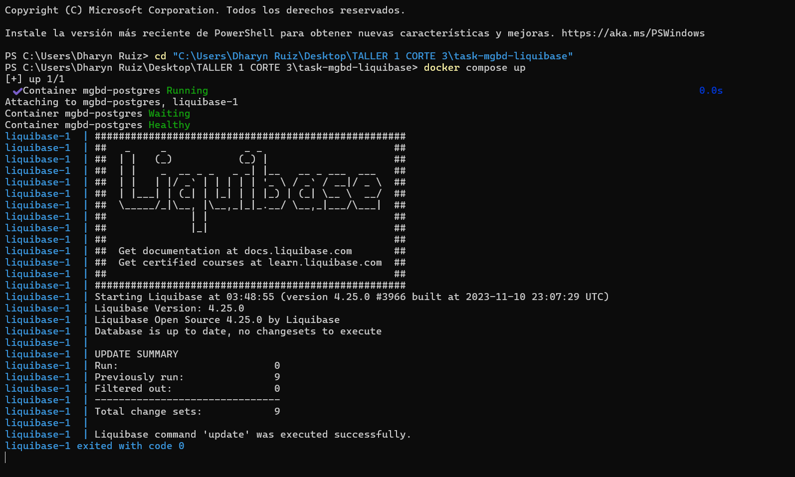
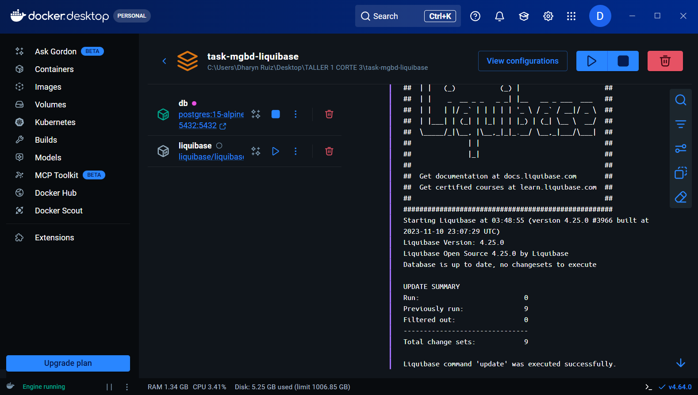
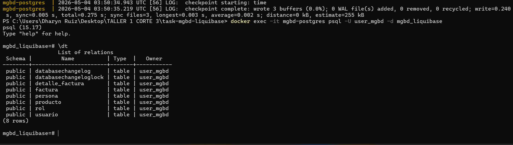
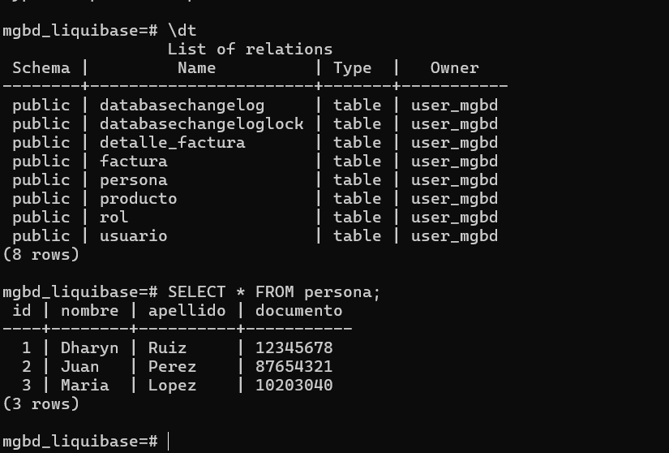
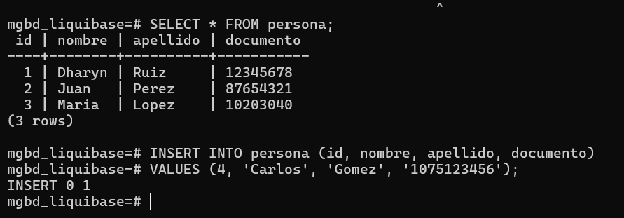
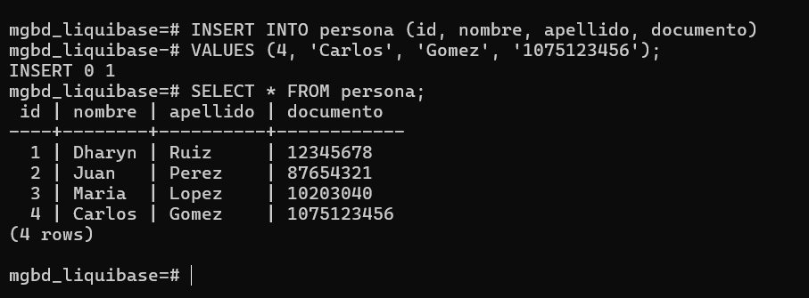
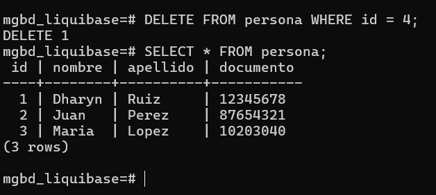
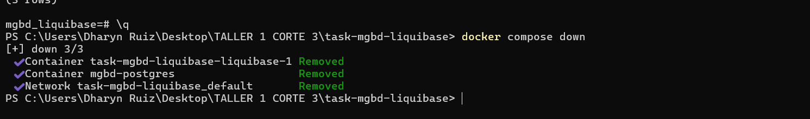

# TALLER INVESTIGATIVO
## CONSTRUCCION DE BASE DE DATOS CON LIQUIBASE 

Este proyecto implementa una arquitectura de base de datos automatizada utilizando contenedores y herramientas de migración
### Guía de Inicio Rápido
para configurar el entorno, ejecutar las migraciones y validar la integridad de los datos.

# 1. Levantar el Contenedor de Base de Datos
   Para iniciar la infraestructura, utilizamos Docker Compose para desplegar un motor PostgreSQL aislado. Ejecuta el siguiente comando en la raíz del proyecto:

# 2. Ejecutar Liquibase (Actualización de tablas y datos)

# 3. Comandos de Validación
### SELECT * FROM persona;

### INSERT INTO persona (id, nombre, apellido, documento)
VALUES (4, 'Carlos', 'Gomez', '1075123456');

### DELETE FROM persona WHERE id = 4;

